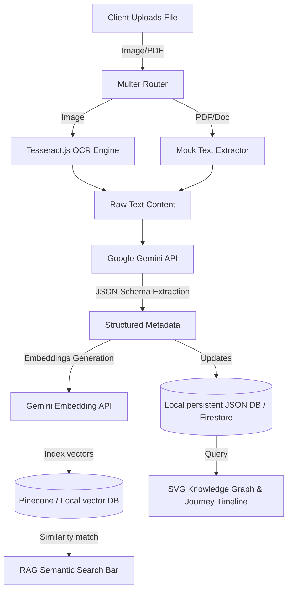

# MemoryVerse AI: AI-Powered Digital Identity Platform

MemoryVerse AI is a secure, enterprise-grade Digital Identity Platform designed for students, recruiters, and academic institutions. The platform processes student-submitted professional files (certificates, projects, transcripts, internship letters, and resumes) in real-time, extracting verified achievements and skills using OCR and Google Gemini AI. It aggregates these credentials into an interactive Knowledge Graph, a digital timeline, and a semantic search database for RAG-driven queries.

---

## 1. Problem Statement
Academic achievements and professional milestones are currently stored as fragmented, static PDF files or self-reported lists on platforms like LinkedIn. This leads to:
* **Recruiter Verification Friction**: Recruiters must manually inspect scanned certificates and letters to verify skills.
* **Disconnected Milestones**: There is no automatic mapping showing how a specific course certificate directly translates to practical project competencies.
* **Ineffective Resume Searching**: Keyword matching fails to identify candidates whose capabilities are described semantically.

MemoryVerse AI solves this by building an AI-powered verification layer that automatically extracts metadata from raw uploads, maps dependencies in an interactive knowledge web, and powers natural language candidate queries.

---

## 2. Platform Architecture



---

## 3. Core Features

### Ingestion & Processing
* **Multi-Format Ingestion**: Supports drag-and-drop uploads for PDF, DOCX, and image formats.
* **Tesseract.js OCR Engine**: Local text extraction from certificate images.
* **Gemini Metadata Parser**: Structural metadata parsing (Issuing body, Title, dates, confidence index) into strict JSON schemas.

### Identity Visualizations
* **Collapsible SVG Knowledge Graph**: Renders student achievements as nodes (User -> Category -> Document -> Skill) with hover highlights, link styling, and drag-and-drop nodes.
* **Journeys Timeline**: Chronological vertical milestones showing career progression.

### AI Search & Assistance
* **RAG-Ready Semantic Search**: Recruiter portal supporting queries like *"React projects"* matching certificates by contextual relevance.
* **AI Career Chatbot**: Personal career assistant providing LinkedIn introductions, skill gap checklists, and study roadmaps.
* **ATS Resume Generator**: Builds clean resumes with editable forms and prints directly to A4 formats.

---

## 4. Tech Stack

* **Frontend**: React 19, TypeScript, Tailwind CSS, React Router DOM, Lucide Icons.
* **Backend**: Node.js, Express, Multer, JWT.
* **AI / OCR Engines**: Google Gemini API, Tesseract.js.
* **Databases**: Firebase Firestore & Storage (Production), Local JSON Persistence (Demo fallback).
* **Vector Store**: Pinecone (Production), Local Cosine Similarity engine (Demo fallback).

---

## 5. Folder Structure

```
memory-ai/
├── backend/
│   ├── config/             # Firebase, Gemini, local DB setup
│   ├── middleware/         # Auth, request validation
│   ├── routes/             # REST endpoints (auth, docs, AI, career)
│   ├── services/           # Gemini, OCR, and Vector RAG services
│   ├── index.js            # Node main server
│   └── package.json
├── src/
│   ├── components/         # SVG Graph, Timeline, layout items
│   ├── contexts/           # Auth and session states
│   ├── layouts/            # Dashboard sidebar, notifications
│   ├── pages/              # Landing page, Dashboard, Chat, Resumes
│   ├── services/           # Axios API wrappers
│   ├── types/              # TypeScript declarations
│   ├── main.tsx            # React entry
│   └── index.css           # Tailwind configurations
├── tsconfig.json
├── package.json
└── README.md
```

---

## 6. Installation & Setup

### Prerequisites
* Node.js v18.0 or higher.
* npm v9.0 or higher.

### Step 1: Clone and Install Dependencies
Navigate to the root directory and install dependencies:
```bash
# Install root and frontend packages
npm install

# Install backend packages
cd backend
npm install
cd ..
```

### Step 2: Configure Environment Variables
Create a `.env` file at the root folder based on the template:
```bash
cp .env.example .env
```
Populate your Google Gemini API key:
```env
VITE_GEMINI_API_KEY=AIzaSy...your_actual_key_here
```
*(Note: If the key is omitted or left as default, the application will automatically enter **Demo Fallback Mode** and simulate all AI/OCR interactions locally).*

### Step 3: Run the Development Server
Start the client and server concurrently with one command:
```bash
npm run dev
```
* Frontend runs at: `http://localhost:5173`
* Backend runs at: `http://localhost:5000`

---

## 7. Firebase & Pinecone Production Setup

### Firebase Ingestion
1. Go to the [Firebase Console](https://console.firebase.google.com/) and create a project.
2. Enable **Firestore Database** and **Storage**.
3. Go to Project Settings -> Service Accounts, select Node.js, and click **Generate New Private Key**.
4. Set the JSON contents of the private key as `FIREBASE_SERVICE_ACCOUNT` in your backend server environment.

### Pinecone Integration
1. Register on [Pinecone](https://www.pinecone.io/) and create an index with `1536` dimensions (for text-embedding-004).
2. Set `PINECONE_API_KEY` and `PINECONE_INDEX_NAME` in your server settings.

---

## 8. Future Scope
* **Certificate Expiry Alarms**: Cron triggers notify students when professional certificates are nearing expiration.
* **LinkedIn Importer**: Automated scraper parsing student resumes from public LinkedIn urls.
* **Job Recommendation Engine**: Automatically matches recruiters' open placements against the student's verified skills graph.
